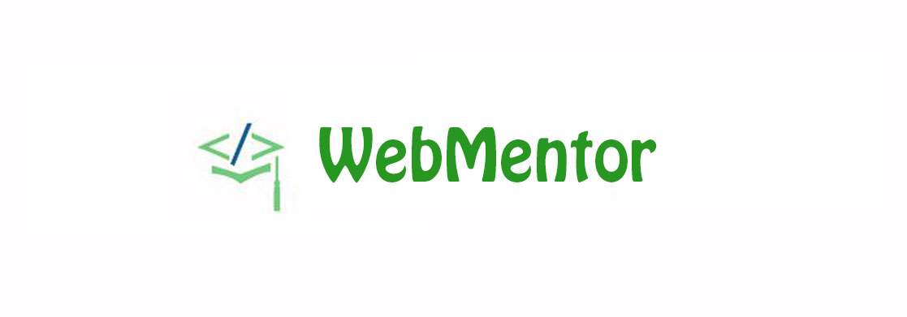

# [WebMentor Developer Student Club - CapacityBay](https://capacitybay-webmentor.github.io/react-app-user-registeration/)

<!-- https://github.com/dscmsit/dscmsit/blob/master/images/HomePageForREADME.jpg?raw=true -->




## Contributions and PR

- All the PRs should be generated against the `Dev` branch
- Remember to run `npm run format` before creating pull request so that the code is formatted.
- Github will create a preview inside pull request, please check if your work is fine.
- If the PR is related to any front end change, please attach relevant screenshots in the pull request description.

## Github Deployment

- You can find the github deployment at https://capacitybay-webmentor.github.io/react-app-user-registeration/ based on the `master branch`
- It might include those changes as well, which are in currently in development and are worked upon
- These changes might not be published yet to the official website.
- So it's recommended to go through the github react deployed website first before raising an issue or making any pull request.

## Quick start

Quick start options:

- [Download from Github](https://capacitybay-webmentor.github.io/react-app-user-registeration/).
- Clone the repo: `https://github.com/dscmsit/dscmsit.github.io.git`.
- `npm install` to install get the nodemodules dependencies.
- 'npm start' to start to start react app.

## Reference links
https://www.adeinetwork.org/
dscmsit.github.io/

```

Please help us follow the best practice to make it easy for the reviewer as well as the contributor.
